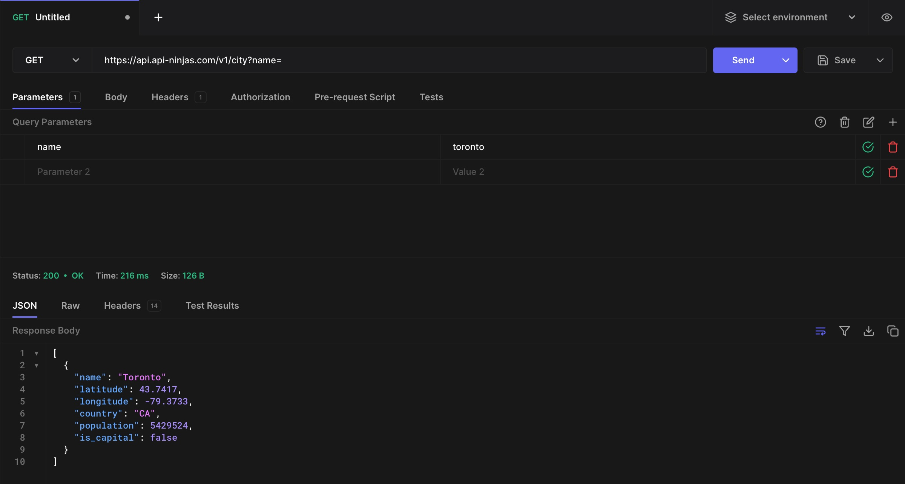

__# api-project
### Project Domain
We are focusing on an interactive trivia-like text-based game revolving around statistics and facts about prominent cities all over the world. A potential name for the project is "the city game".

### Description of Application
We are providing the users with an interface where they can input words from their keyboard, extract information from quantitative or qualitative data and make decisions accordingly to win.

below is a brief description of the "human vs. computer" mode of the city game:

1. Computer randomly generates a city from our database.
2. Eddie chooses one out of the many categories of data on this city to be shown towards him, for at most 10 statistics(facts) for one round.
3. Eddie is able and encouraged to make a guess through the input keyboard during any of the 10 statistics. 
4. If Eddie successfully guesses the city before or right after using up the 10 statistics, he wins the round; otherwise, he loses. 
5. The second round begins, where Eddie inputs a city of his choice for the computer to guess with more or less similar processes. 

The "human vs. human" mode would basically obtain a similar structure, but a chat feature between opponents will be available, with a greater freedom for the users to utilize data outside our database. 

### Documentation for API
1. read and extract from an external database of cities and their statistics
2. option for users to access google earth/ google map to aid the guessing
3. The following link is to the documentation for the City API we are exploring to use: https://api-ninjas.com/api/city
4. The following link is to the documentation for the google maps API we are exploring to use: https://developers.google.com/maps/documentation/embed/get-started

### Example Usage of API
1. Using hoppscotch.io, this is an image of the api result we get.
    
### Example Output of an API Call
1. The output for the City API call would be something like a city's population.
2. The  output for the Google maps API call would be a streetview image.

### List of Ongoing Technical Problems
1. The City API we are exploring seems to be very highly rate-limited, as we keep getting a 500 error. We might need to consider other similar APIs with less limited free versions.
2. Possible technical issues we did not encounter but were brainstorming/anticipating that could potentially block progress: Lack of proper documentation or examples for the APIs, making it hard to understand how to use them correctly and efficiently. Incompatibility or inconsistency between different APIs, especially when they are from different vendors or platforms. This can cause errors or unexpected results when trying to integrate them(formats not familiar with class examples). Security or privacy risks when using APIs that involve sensitive data or transactions. This can expose the data to unauthorized access or manipulation, or violate the regulations or policies of the data owners(but can be solved with the right security protocols and encryption methods).

